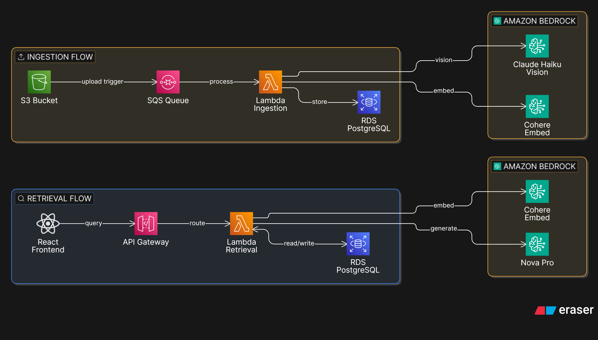

# Serverless Document Intelligence RAG on AWS

A production-ready Retrieval-Augmented Generation (RAG) system built on AWS serverless infrastructure. Transforms dense, unstructured economic PDF reports into a conversational Q&A interface powered by hybrid retrieval, vision AI, and window memory.

Built as a portfolio demonstration of end-to-end AI engineering: from raw PDF ingestion to a React frontend, fully deployed on AWS with Terraform.

---

## Demo

> 📸 *Screenshots and demo video coming soon*

---

## What It Does

Upload a PDF report → the system automatically ingests, parses, and indexes it. Ask questions in natural language → get precise, sourced answers with referenced figures and tables.

The system was developed and validated on **World Bank Global Economic Prospects (GEP)** and **World Bank Global Commodity Markets Outlook (CMO)** reports.

---

## Architecture



### Ingestion Pipeline

```
S3 Upload → SQS → Lambda
                      │
                      ├── pdfplumber geometric analysis
                      │     ├── TEXT blocks → RecursiveCharacterTextSplitter
                      │     ├── FIGURE blocks → Claude Haiku Vision → semantic caption
                      │     └── TABLE blocks → structured cell extraction + Vision
                      │
                      ├── Contextual headers (doc name + TOC section per chunk)
                      ├── Domain detection (embedding centroid → closest domain)
                      ├── Cohere Embed Multilingual v3
                      └── PostgreSQL/pgvector (RDS)
```

### Retrieval Pipeline

```
User Query → API Gateway → Lambda
                  │
                  ├── Semantic cache check (pgvector cosine similarity)
                  ├── Domain routing (corpus-level embedding centroid matching)
                  ├── Hybrid retrieval: BM25 + Vector Search → RRF fusion
                  ├── Window memory (rolling summary via Amazon Nova Pro)
                  ├── Amazon Nova Pro → answer generation
                  └── API Gateway → React frontend
```

---

## Tech Stack

| Layer | Technology |
|---|---|
| **Ingestion** | AWS Lambda (Python 3.12), SQS, S3 |
| **PDF Parsing** | pdfplumber, PyMuPDF (fitz) |
| **Vision AI** | Claude Haiku 3 (Bedrock) |
| **Embeddings** | Cohere Embed Multilingual v3 (Bedrock) |
| **Vector Store** | PostgreSQL 16 + pgvector (RDS) |
| **LLM** | Amazon Nova Pro (Bedrock) |
| **Retrieval** | BM25 (rank-bm25) + cosine similarity + RRF |
| **Memory** | Rolling window summary stored in RDS |
| **Semantic Cache** | pgvector similarity search on query embeddings |
| **Frontend** | React + API Gateway (HTTP API) |
| **IaC** | Terraform |
| **Region** | ap-southeast-1 |

---

## Key Features

**Geometric PDF parsing** — Instead of relying on text extraction libraries that flatten layout, the pipeline uses a purely geometric approach (pdfplumber + fitz) to identify FIGURE and TABLE blocks by font analysis, then applies a "sandwich" strategy to extract text bands above and below each visual element independently.

**Vision-augmented indexing** — Each detected figure or table is rendered as a JPEG crop and sent to Claude Haiku Vision with surrounding text context. The crop is intentional: sending the full page would introduce visual noise from surrounding text and increase image size unnecessarily. By isolating only the figure or table area, the vision model receives a focused, lightweight input, producing a denser and more accurate semantic caption, which is then embedded and indexed to make visual content fully searchable.

**Contextual retrieval headers** — Every chunk is prefixed with `[Document Name | Chapter | Section]` derived from LLM-extracted TOC, following Anthropic's Contextual Retrieval pattern.

**Hybrid retrieval with RRF** — Economic reports are dense with technical terminology, country codes, and acronyms (EMDEs, GEP, CMO, RHS) that can lose their specificity during the embedding process; a query for "EMDEs" may not retrieve a chunk where the acronym appears verbatim if the vector representations are too semantically smooth. BM25 solves this by matching exact tokens regardless of semantic context. Vector search handles the broader semantic similarity. RRF (Reciprocal Rank Fusion) combines both rankings without requiring score calibration, ensuring neither signal dominates.

**Domain routing** — At ingestion time, a corpus-level embedding centroid is computed for each document collection and stored in RDS. At query time, the query embedding is compared against all domain centroids to identify the most relevant corpus before any chunk is loaded. This means only the chunks belonging to the matched domain are loaded into memory and indexed with BM25 — significantly improving retrieval performance by avoiding unnecessary computation on unrelated documents, and keeping the in-memory chunk cache lean across Lambda invocations.

**Window memory** — Conversation history is stored in RDS. Every 3 turns, Amazon Nova Pro generates a rolling summary of the session so far. On each subsequent query, this summary plus the most recent turns are injected into the generation prompt, ensuring the model retains context across the full conversation without unbounded context growth.

**Semantic cache** — Query embeddings are stored alongside answers. Near-duplicate queries (cosine similarity ≥ threshold) return cached responses instantly, skipping retrieval and generation entirely.

**Resumable ingestion** — If a Lambda times out during the ingestion, the pipeline resumes from the last successfully ingested page without recomputing TOC structure, page offset, or last content page boundary; all of which are persisted in a `toc_cache` table in RDS at the start of ingestion and deleted on successful completion.

**Monitoring dashboard** — A built-in React dashboard reads directly from `queries_history` via a `GET /stats` Lambda route, with no external monitoring tools required. Surfaces KPIs including total queries, average latency, semantic cache hit rate, and positive feedback rate, alongside a 30-day query volume chart, top sessions by query count, and a live table of the 20 most recent queries with cache hit and feedback status, providing full observability over system usage and retrieval quality in production.

---

## Project Structure

```
.
├── lambdas/
│   ├── ingestion/          # PDF ingestion pipeline
│   ├── retrieval/          # Query handling, retrieval, generation, dashboard
│ 
├── layers/
│   └── shared/             # Shared utilities: DB pool, embeddings, config
├── frontend/               # React application
└── terraform/              # Full AWS infrastructure as code
```

---

## Infrastructure (Terraform)

All AWS resources are defined in Terraform:

- **VPC** — Default VPC with Interface Endpoints for Bedrock, Secrets Manager, KMS, SQS
- **RDS** — PostgreSQL 16 on `db.t3.micro`, storage encrypted, pgvector extension
- **Lambda** — 3 functions: ingestion (900s timeout, 2048MB), retrieval (30s, 2048MB), upload (30s, 256MB)
- **SQS** — Main queue + DLQ, visibility timeout 1200s aligned with Lambda timeout
- **S3** — Versioning enabled, public access blocked, AES256 encryption
- **Secrets Manager** — KMS-encrypted DB credentials
- **API Gateway** — HTTP API with routes: `POST /query`, `POST /feedback`
- **Bastion host** — EC2 `t3.micro` for RDS admin access via SSH tunnel

---

## Retrieval Quality

Evaluated with [RAGAS](https://ragas.io/) + MLflow on a curated set of 20+ questions across GEP and CMO reports. Four retrieval variants compared:

| Variant | Faithfulness | Answer Relevancy | Context Precision | Context Recall | Avg Latency |
|---|---|---|---|---|---|
| V1 — Vector only | 0.932 | 0.802 | 0.620 | 0.900 | 0.01s |
| V2 — Vector + Rerank | 0.951 | 0.809 | 0.779 | 0.850 | 6.93s |
| **V3 — Hybrid RRF** ✅ | 0.917 | **0.847** | 0.646 | 0.875 | **0.14s** |
| V4 — Hybrid RRF + Rerank | 0.952 | 0.720 | 0.743 | 0.900 | 5.41s |

V3 (BM25 + Vector → RRF) selected as production variant: best answer relevancy across all configurations, with latency 38x lower than V4 (0.14s vs 5.41s). V4 was discarded despite marginally higher faithfulness: Cohere Rerank v3.5 is not available in ap-southeast-1 and requires cross-region inference routing through ap-northeast-1, adding significant latency overhead that makes it unsuitable for a production retrieval pipeline.

- Retrieved chunk vector scores: consistently above 0.6 (Cohere Embed Multilingual v3 cosine similarity)
- Domain routing similarity: 0.47–0.53 for in-domain queries
- Window memory validated — rolling summary confirmed working across multiple turns


---

## Author

**Luca De Salvia** — AI Integration Engineer  
Freelance | ex-Oracle EMEA AI CoE  
[LinkedIn](https://www.linkedin.com/in/luca-de-salvia-341196201/) · [GitHub](https://github.com/Reasy94)